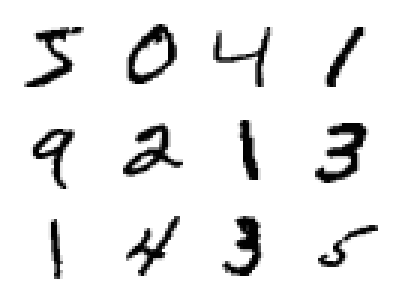
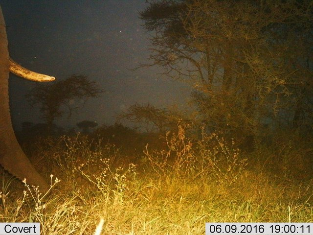
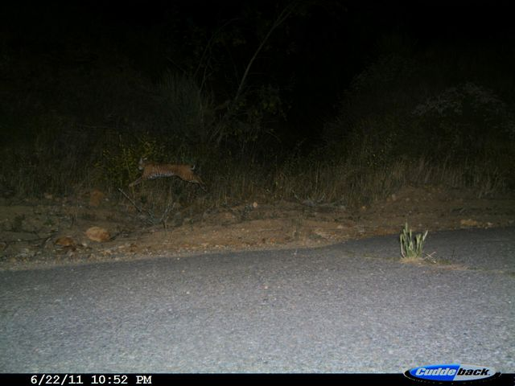
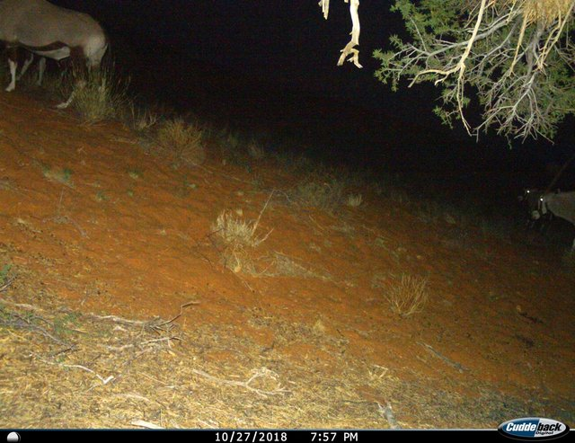
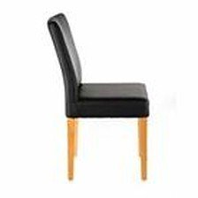
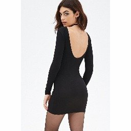
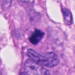

# Datasets

This document lists every dataset used by the exercises, with a short description
of its origin, content, and the exercise(s) it appears in. Curation details and
licensing for the course-curated subsets live in their dataset cards under
[scripts/prepare_datasets/](../scripts/prepare_datasets/).

## MNIST

The classic dataset of 28×28 grayscale handwritten digits (0–9), 60k train
and 10k test images. Used in [exercises/00_pytorch](../exercises/00_pytorch)
as a small, fast-loading dataset for first contact with PyTorch tensors,
`Dataset`, and `DataLoader`. Loaded directly from `torchvision.datasets.MNIST`.

## Snapshot Safari SER (Serengeti)

A balanced subset of camera-trap images from Serengeti National Park
(Snapshot Safari 2024 Expansion), curated to ten species classes plus an
`empty` class (~1850 images total). Used as the
**default** camera-trap dataset in
[01_image_data](../exercises/01_image_data),
[02_classification](../exercises/02_classification),
[04_adaptation](../exercises/04_adaptation), and
[05_backbones](../exercises/05_backbones).

## Caltech Camera Traps (CCT20)

A balanced 8-class subset of the CCT20 benchmark (200 images per class:
bobcat, cat, coyote, empty, opossum, rabbit, raccoon, squirrel). Sourced
from LILA Science. Offered as an **alternative** camera-trap dataset in
exercises 02, 04, and 05. When a
North-American species mix is preferred.

## Snapshot Kgalagadi

A subset of Snapshot Kgalagadi Season 1 (Kalahari camera traps) covering
six classes: empty, gemsbokoryx, birdother, steenbok, ostrich,
jackalblackbacked. Heavily imbalanced — `empty` accounts for ~78% of the
~3400 images, which makes it the **alternative of choice for dealing with
class imbalance** in exercises 02, 04, and 05.

## Amazon Berkeley Objects (ABO) Furniture

A curated subset of the Amazon Berkeley Objects dataset, restricted to six
furniture categories (bed, chair, lamp, sofa, storage, table) with multiple
views per item, ~25k centre-cropped 224×224 JPEGs. The multi-view structure
(via `retrieval_groups.json`) makes it well-suited for image retrieval.
Used as the **default** dataset in
[03_retrieval](../exercises/03_retrieval).

## DeepFashion (In-Shop Retrieval)

A 5-class coarse-label subset (dresses, outerwear, pants, skirts, tops) of
the DeepFashion In-Shop Clothes Retrieval Benchmark from MMLAB/CUHK, ~3300
images split by item ID so all views of one product stay in the same split.
Offered as the **alternative** to ABO in
[03_retrieval](../exercises/03_retrieval). **Internal use only — do not
redistribute** (see the dataset card for license details).

## AMI-Br (Atypical Mitotic Figures — Breast)

128×128 histopathology patches of mitotic figures from human breast cancer
slides (subset of TUPAC16 + MIDOG21), with binary labels for normal vs.
atypical mitoses. Used in
[04_adaptation_lora](../exercises/04_adaptation_lora) as a small,
domain-shifted target task for parameter-efficient fine-tuning (LoRA).

